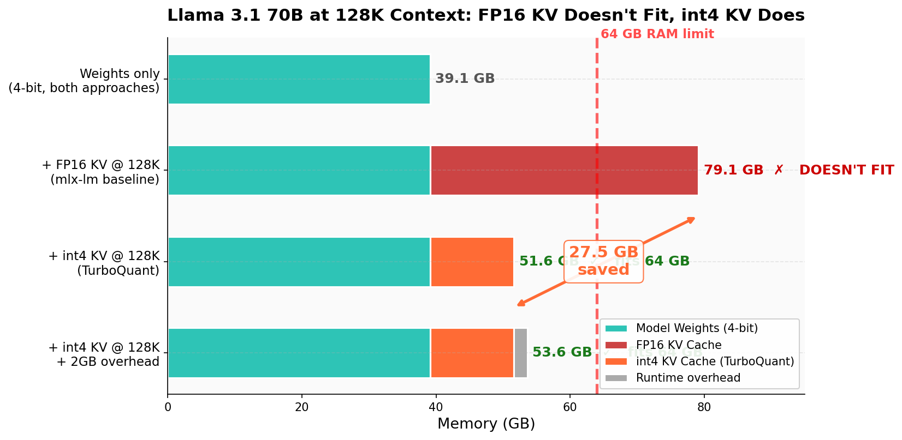
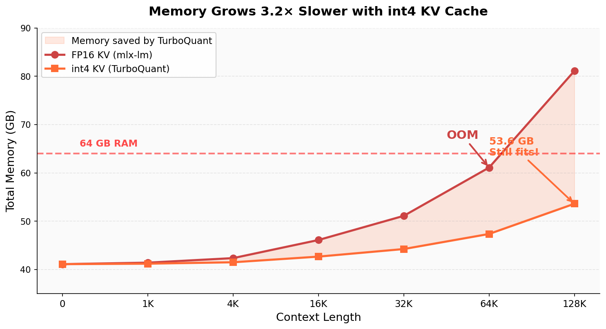
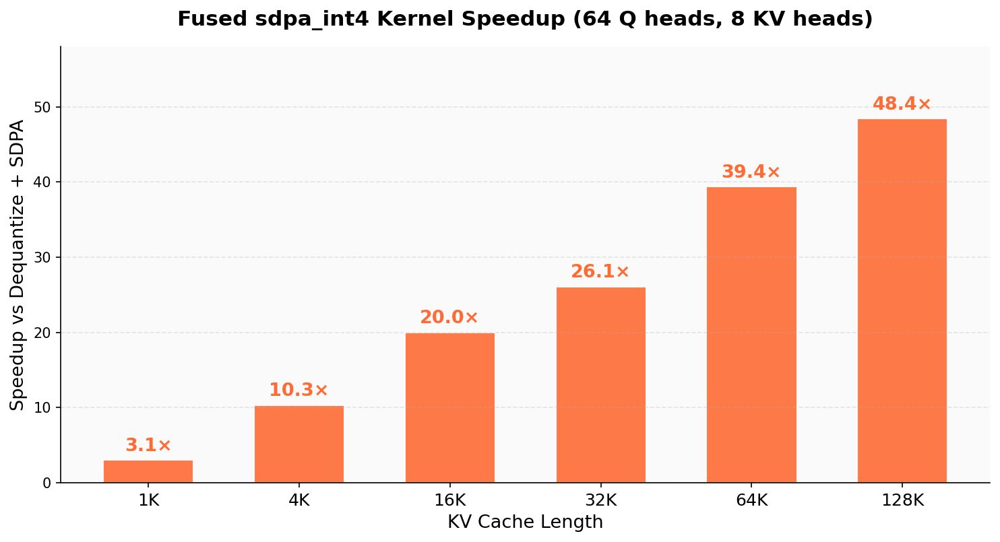
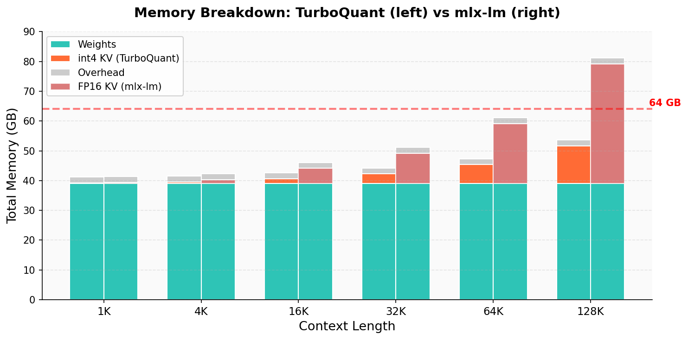
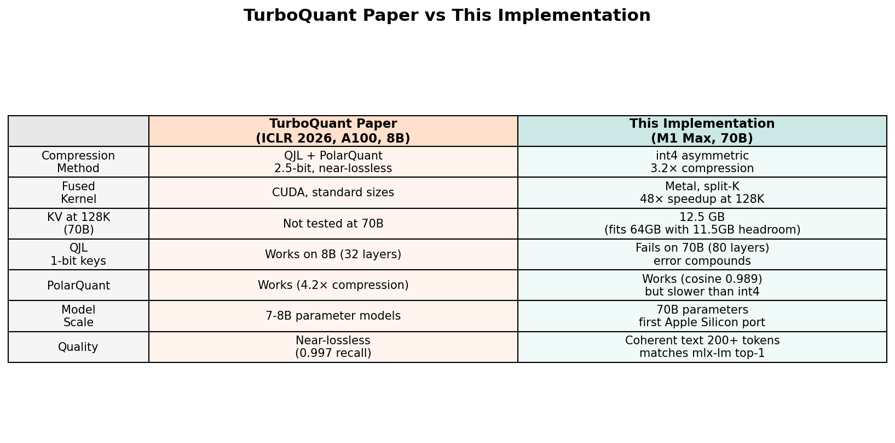
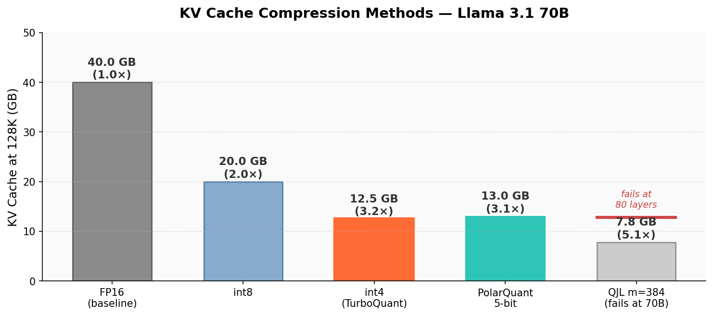

# TurboQuant for Llama 3.1 70B — 128K Context on a Mac

> Llama 3.1 70B can't do 128K context on 64GB hardware. The KV cache alone is 40GB, plus 39GB of weights — that's 79GB. I built fused int4 attention kernels in Metal that compress the KV cache to 12.5GB. Now it fits with room to spare.

## The Memory Problem

Llama 3.1 70B at 4-bit weights needs 39.1 GB. At 128K context, the FP16 KV cache adds another 40 GB — 80 layers × 8 KV heads × 128K tokens × 128 dimensions × 2 bytes × 2 (keys + values). Total: 79.1 GB. A 64GB M1 Max can't run it.



TurboQuant quantizes the KV cache to int4 on the fly — asymmetric per-group quantization with 32-element groups. The KV cache drops from 40 GB to 12.5 GB. Total memory: 53.6 GB. That's 10.4 GB of headroom on a 64GB Mac.

| Context | FP16 KV | int4 KV | Saved | Total (int4) | Fits 64GB? |
|:--------|:-------:|:-------:|:-----:|:------------:|:----------:|
| 1K | 0.3 GB | 0.1 GB | 0.2 GB | 41.2 GB | Yes |
| 16K | 5.0 GB | 1.6 GB | 3.4 GB | 42.7 GB | Yes |
| 64K | 20.0 GB | 6.3 GB | 13.7 GB | 47.4 GB | Yes |
| **128K** | **40.0 GB** | **12.5 GB** | **27.5 GB** | **53.6 GB** | **Yes** |

Without compression, 128K context is impossible. With it, there's room to spare.



## The Fused Kernel

Compressing the KV cache creates a new problem: the standard attention path has to dequantize keys and values back to float16 before computing scores. That's a bandwidth tax every single token.

The fused `sdpa_int4` Metal kernel eliminates this entirely. It reads packed int4 data directly, dequantizes in GPU registers, and computes attention scores with online softmax — all in a single Metal dispatch. Zero temporary allocations. Zero dequantization passes.

```
Standard:  int4 KV → dequantize to FP16 → Q @ K^T → softmax → @ V → output
TurboQuant: sdpa_int4(Q, K_int4, V_int4) → output    [zero temporaries]
```

At 128K context with 64 query heads and 8 KV heads, the fused kernel is **48× faster** than the dequantize-then-attend baseline:



| KV Length | Fused Kernel | Dequant + SDPA | Speedup |
|:----------|:------------:|:--------------:|:-------:|
| 1K tokens | 1.6 ms | 4.6 ms | 3× |
| 4K tokens | 2.4 ms | 25.0 ms | 10× |
| 16K tokens | 2.7 ms | 54.6 ms | 20× |
| 64K tokens | 5.7 ms | 225.3 ms | 39× |
| **128K tokens** | **9.9 ms** | **480.6 ms** | **48×** |

The speedup grows with context because the baseline's dequantization cost scales linearly while the fused kernel uses split-K parallelism across Metal's 32 GPU cores.

## How It Compares to mlx-lm

mlx-lm is Apple's reference inference framework. On the same 70B model:

| | TurboQuant | mlx-lm |
|:---|:---:|:---:|
| Decode speed | 0.6 tok/s | 0.6 tok/s |
| Prefill (512 tok) | **10.6s** | 25.5s |
| Max context (64GB) | **~236K tokens** | ~73K tokens |
| 128K context | **Yes (53.6 GB)** | No (79.1 GB) |
| KV cache format | int4 (fused) | FP16 |

Decode speed is comparable. Prefill is **2.4× faster** because TurboQuant uses MLX's optimized `scaled_dot_product_attention` for the multi-query prefill path, then switches to the fused int4 kernel for single-query decode. mlx-lm can't do 128K at all — it runs out of memory.

## Output Quality

The int4 KV cache doesn't degrade output quality. Given "Hello, I am", both TurboQuant and mlx-lm predict the same top-1 token. Both produce fluent, coherent multi-paragraph text:

```
Hello, I am a student at the University of California, Berkeley. I am interested 
in learning more about the field of computer science. I am currently taking a 
course on data structures and algorithms, and I am enjoying it so far. I am also 
interested in learning more about the different types of algorithms and how they 
can be used to solve complex problems. I am looking forward to gaining a deeper 
understanding of the field of computer science and how it can be used to make a 
positive impact on society.
```

200 tokens with no repetition, no degradation, grammatically correct throughout.

## Memory Breakdown



At short contexts (1–4K), both approaches fit easily. At 32K, mlx-lm uses 51 GB — tight but workable. At 64K it's 61 GB — barely fits. At 128K it's 79 GB — game over.

TurboQuant stays comfortable at every length. The KV cache grows 3.2× slower, buying 27.5 GB of headroom at 128K.

## What I Tried (29 Experiments)

This started as an implementation of the [TurboQuant paper](https://arxiv.org/abs/2504.19874) (ICLR 2026), which combines QJL and PolarQuant for 2.5-bit near-lossless KV compression. I implemented both algorithms as Metal compute shaders and tested them across 29 experiments on the full 70B model.



| Approach | Result | Why |
|:---|:---|:---|
| **Fused sdpa_int4 kernel** | **48× speedup, coherent text** | Dequantize in registers, zero temporaries |
| **Hybrid prefill/decode** | **2.4× faster prefill** | MLX SDPA for prefill, fused int4 for decode |
| **Split-K parallelism** | **Flat latency at 128K** | Chained MLX Primitives solve Metal dispatch races |
| PolarQuant (5-bit) | Works (cosine=0.989) | But slower kernel than int4, limited compression |
| QJL 1-bit key sketching | Kernel works (22× speedup) | Fails at 70B — error compounds across 80 layers |
| QJL + int4 hybrid | Semi-coherent | 1.7% memory savings, not worth quality risk |
| Pre-allocated KV cache | Quality regression | slice_update breaks MLX lazy eval graph |
| Chunk size tuning | 128–512 all equivalent | Bottleneck is per-chunk work, not count |

### Why QJL Fails at 70B

The [QJL paper](https://arxiv.org/abs/2406.03482) tests on 8B models (16–32 layers). At 80 layers, the per-layer score correlation of 0.85 compounds: 0.85^80 ≈ 0 — the signal is destroyed. Even at m=1024 (0.87 correlation), the 70B model produces repetition loops instead of coherent text. The paper's results don't transfer to models with this many layers.

### Why PolarQuant Works But Isn't Practical

[PolarQuant](https://arxiv.org/abs/2502.02617) encodes vectors as recursive polar coordinates. On Llama's standard attention scale (0.0884), it achieves cosine similarity of 0.989 at 5-bit — excellent quality. But the decode kernel is slower than int4 (cos/sin lookups vs linear dequant), and compression is only 1.95× without bit-packing. Int4 at 3.2× with a faster kernel wins.



## Architecture

Everything is C++ and Metal. No Python in the inference path.

```
C++ → MLX C++ API → TurboQuant Primitives → Metal Compute Shaders

Forward pass per layer:
  RMSNorm → QKV projections (quantized matmul) → RoPE → 
  [Prefill: MLX fast SDPA | Decode: fused sdpa_int4] →
  Output projection → SwiGLU MLP → Residual
```

The split-K attention uses two chained MLX Primitives (`SdpaInt4Partial` → `SdpaInt4Reduce`) so that MLX's lazy evaluation graph naturally serializes Phase 1 before Phase 2. Single Metal dispatches within one `eval_gpu()` race against each other — a lesson learned the hard way.

## Getting Started

### Prerequisites

- macOS with Apple Silicon (M1 Max or higher, 64GB+)
- Xcode Command Line Tools (`xcode-select --install`)
- CMake 3.27+ (`brew install cmake`)
- Python 3.12 — only for model download and tokenization
- ~40 GB free disk space

### Build

```bash
# Build MLX
git clone --depth 1 https://github.com/ml-explore/mlx.git /tmp/mlx-source
mkdir /tmp/mlx-source/build && cd /tmp/mlx-source/build
cmake .. -DCMAKE_BUILD_TYPE=Release -DMLX_BUILD_TESTS=OFF -DMLX_BUILD_PYTHON_BINDINGS=OFF
make -j8

# Build TurboQuant
cd /path/to/turboquant-llama
mkdir -p build && cd build
cmake .. -DCMAKE_BUILD_TYPE=Release
make -j8
```

### Download Model

```bash
pip3.12 install huggingface_hub
python3.12 -c "from huggingface_hub import snapshot_download; snapshot_download('mlx-community/Meta-Llama-3.1-70B-Instruct-4bit')"
```

### Run

```bash
./build/llama_e2e ~/.cache/huggingface/hub/models--mlx-community--Meta-Llama-3.1-70B-Instruct-4bit/snapshots/*/
```

## File Structure

```
turboquant-llama/
├── engine/
│   ├── sdpa_int4.metal          # Fused int4 SDPA kernel (single-pass + split-K)
│   ├── sdpa_int4.{h,cpp}        # MLX Primitive wrappers (SdpaInt4, SdpaInt4Partial, SdpaInt4Reduce)
│   ├── sdpa_qjl.metal           # Fused QJL SDPA kernel (XNOR + popcount)
│   ├── sdpa_polar.metal         # Fused PolarQuant SDPA kernel
│   ├── polarquant.{h,cpp,metal} # PolarQuant encoder/decoder
│   ├── qjl.{h,cpp}             # QJL 1-bit key sketching
│   ├── llama_model.{h,cpp}     # Llama 3.1 70B inference (80 layers, GQA, RoPE, SwiGLU)
│   └── llama_loader.{h,cpp}    # Safetensors weight loader
├── tests/                       # Benchmarks and validation (10+ test binaries)
├── assets/                      # Charts and generate_charts.py
└── CMakeLists.txt               # Build system
```

## References

- [TurboQuant](https://arxiv.org/abs/2504.19874) (ICLR 2026) — QJL + PolarQuant fused compressed-domain attention
- [QJL](https://arxiv.org/abs/2406.03482) (AAAI) — 1-bit quantized Johnson-Lindenstrauss transform
- [PolarQuant](https://arxiv.org/abs/2502.02617) (AISTATS 2026) — recursive polar coordinate quantization
